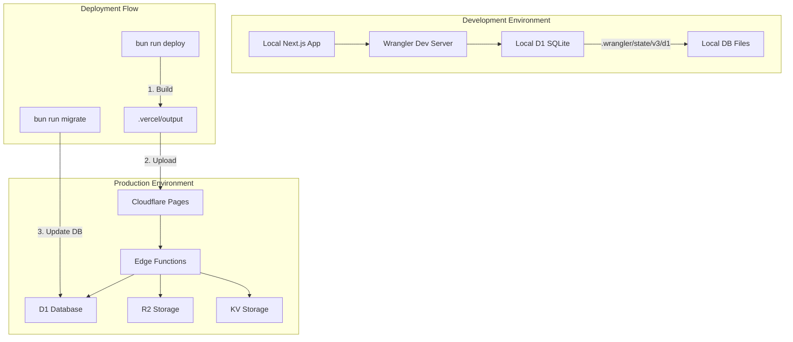
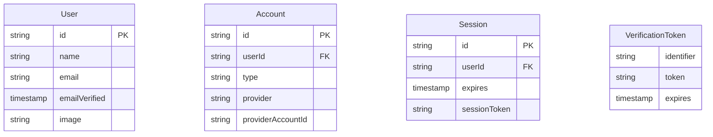
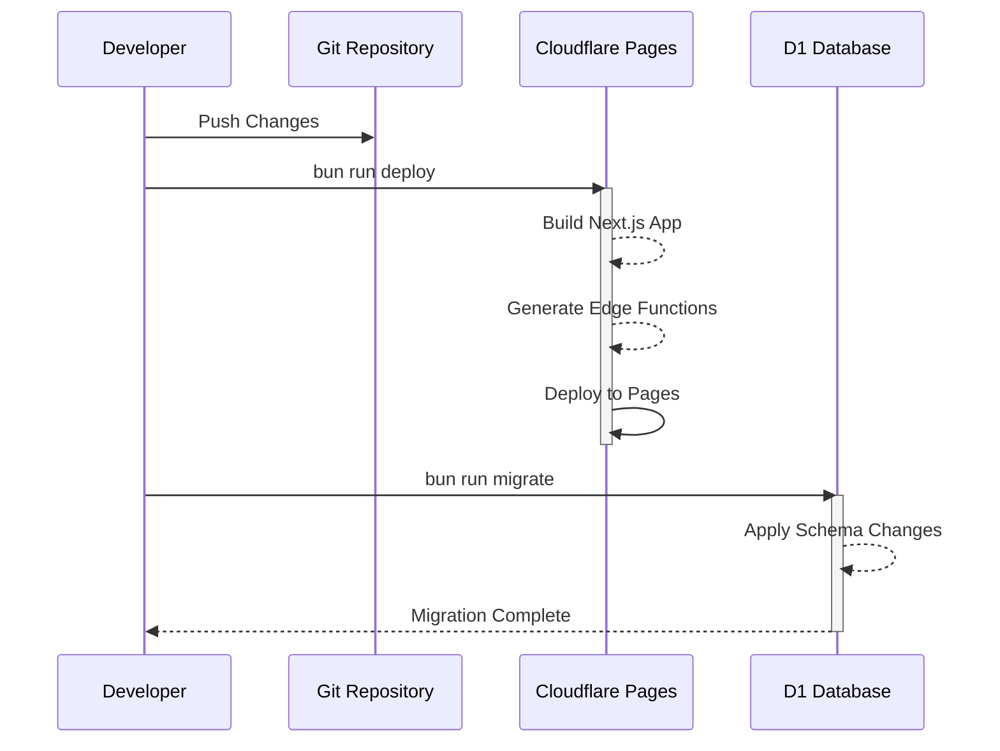
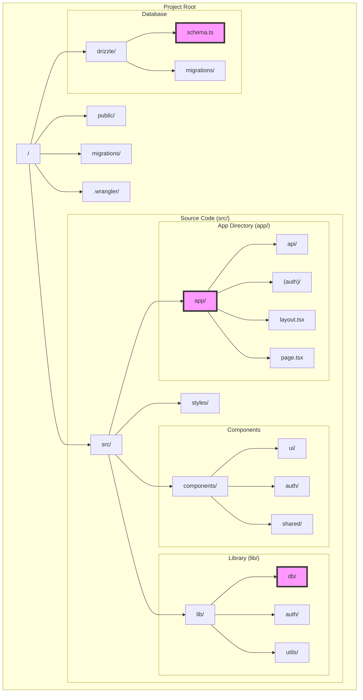

# 🚀 Full-Stack Cloudflare SaaS Kit

**_Build and deploy scalable products on Cloudflare with ease._**

An opinionated, batteries-included starter kit for quickly building and deploying SaaS products on Cloudflare. This is a [Next.js](https://nextjs.org/) project bootstrapped with [`c3`](https://developers.cloudflare.com/pages/get-started/c3).

This is the same stack used to build [Supermemory.ai](https://Supermemory.ai) which is open source at [git.new/memory](https://git.new/memory)

Supermemory now has 20k+ users and it runs on $5/month. safe to say, it's _very_ effective.

## The stack includes:

- [Next.js](https://nextjs.org/) for frontend
- [TailwindCSS](https://tailwindcss.com/) for styling
- [Drizzle ORM](https://orm.drizzle.team/) for database access
- [NextAuth](https://next-auth.js.org/) for authentication
- [Cloudflare D1](https://www.cloudflare.com/developer-platform/d1/) for serverless databases
- [Cloudflare Pages](https://pages.cloudflare.com/) for hosting
- [ShadcnUI](https://shadcn.com/) as the component library

## Getting Started

1. Make sure that you have [Wrangler](https://developers.cloudflare.com/workers/wrangler/install-and-update/#installupdate-wrangler) installed. And also that you have logged in with `wrangler login` (You'll need a Cloudflare account)

2. Clone the repository and install dependencies:
   ```bash
   git clone https://github.com/Dhravya/cloudflare-saas-stack
   cd cloudflare-saas-stack
   npm i -g bun
   bun install
   bun run setup
   ```

3. Run the development server:
   ```bash
   bun run dev
   ```

Open [http://localhost:3000](http://localhost:3000) with your browser to see the result.

## Cloudflare Integration

Besides the `dev` script, `c3` has added extra scripts for Cloudflare Pages integration:
- `pages:build`: Build the application for Pages using [`@cloudflare/next-on-pages`](https://github.com/cloudflare/next-on-pages) CLI
- `preview`: Locally preview your Pages application using [Wrangler](https://developers.cloudflare.com/workers/wrangler/) CLI
- `deploy`: Deploy your Pages application using Wrangler CLI
- `cf-typegen`: Generate typescript types for Cloudflare env.

> __Note:__ While the `dev` script is optimal for local development, you should preview your Pages application periodically to ensure it works properly in the Pages environment.

## Bindings

Cloudflare [Bindings](https://developers.cloudflare.com/pages/functions/bindings/) allow you to interact with Cloudflare Platform resources. You can use bindings during development, local preview, and in the deployed application.

For detailed instructions on setting up bindings, refer to the Cloudflare documentation.

## Database Migrations

### D1 Migrations with Wrangler

Cloudflare D1 uses SQLite and supports migrations through Wrangler CLI. Here's how to manage your database:

1. **Create a new migration** (when you have schema changes):
   ```bash
   wrangler d1 migrations create cloudflare-saas-stack-db <DESCRIPTION>
   ```

2. **Apply migrations locally** (for development):
   ```bash
   bun run db:migrate:dev
   ```

3. **Apply migrations to production**:
   ```bash
   bun run db:migrate:prod
   ```

4. **List applied migrations**:
   ```bash
   wrangler d1 migrations list cloudflare-saas-stack-db --remote
   ```

### Deployment Workflow

For a complete deployment including database migrations:

1. **Build and deploy application**:
   ```bash
   bun run deploy
   ```

2. **Apply database migrations**:
   ```bash
   bun run migrate
   ```

Or use the combined command:
```bash
bun run deploy:full
```

### Migration Best Practices

- Always test migrations locally before applying to production
- Use `--dry-run` to preview changes:
  ```bash
  wrangler d1 migrations apply cloudflare-saas-stack-db --remote --dry-run
  ```

- Rollback migrations if needed:
  ```bash
  wrangler d1 migrations apply cloudflare-saas-stack-db --remote --down
  ```

### Using Drizzle ORM

The project includes Drizzle ORM for database management:

- **Generate migrations** from schema changes:
  ```bash
  bun run db:generate
  ```

- **Inspect database**:
  - Local: `bun run db:studio:dev`
  - Production: `bun run db:studio:prod`

## Cloudflare R2 Bucket CORS / File Upload

Don't forget to add the CORS policy to the R2 bucket. The CORS policy should look like this:

```json
[
  {
    "AllowedOrigins": [
      "http://localhost:3000",
      "https://your-domain.com"
    ],
    "AllowedMethods": [
      "GET",
      "PUT"
    ],
    "AllowedHeaders": [
      "Content-Type"
    ],
    "ExposeHeaders": [
      "ETag"
    ]
  }
]
```

You can now even set up object upload.

## Manual Setup

If you prefer manual setup:

1. Create a Cloudflare account and install Wrangler CLI.
2. Create a D1 database: `bunx wrangler d1 create ${dbName}`
3. Create a `.dev.vars` file in the project root with your Google OAuth credentials and NextAuth secret.
   1. `AUTH_SECRET`, generate by command `openssl rand -base64 32` or `bunx auth secret`
   2. `AUTH_GOOGLE_ID` and `AUTH_GOOGLE_SECRET` for google oauth.
      1. First create [OAuth consent screen](https://console.cloud.google.com/apis/credentials/consent). Tips: no wait time if you skip logo upload.
      2. Create [credential](https://console.cloud.google.com/apis/credentials). Put `https://your-domain` and `http://localhost:3000` at "Authorized JavaScript origins". Put `https://your-domain/api/auth/callback/google` and `http://localhost:3000/api/auth/callback/google` at "Authorized redirect URIs".
4. Generate db migration files: `bun run db:generate`
5. Run local migration: `bunx wrangler d1 execute ${dbName} --local --file=migrations/0000_setup.sql` or using drizzle `bun run db:migrate:dev`
6. Run remote migration: `bunx wrangler d1 execute ${dbName} --remote --file=migrations/0000_setup.sql` or using drizzle `bun run db:migrate:prod`
7. Start development server: `bun run dev`
8. Deploy: `bun run deploy`

## The Beauty of This Stack

- Fully scalable and composable
- No environment variables needed (use `env.DB`, `env.KV`, `env.Queue`, `env.AI`, etc.)
- Powerful tools like Wrangler for database management and migrations
- Cost-effective scaling (e.g., $5/month for multiple high-traffic projects)

Just change your Cloudflare account ID in the project settings, and you're good to go!

## Architecture Overview



### Current Infrastructure

1. **Wrangler Configuration** (`wrangler.toml`):
   - D1 Database: `cloudflare-saas-stack-db`
   - Pages Build Output: `.vercel/output/static`
   - Node.js Compatibility Mode
   - Smart Placement Mode

2. **Environment Separation**:
   - **Local Development**:
     - SQLite files in `.wrangler/state/v3/d1`
     - Local D1 session for development
     - Drizzle Studio for database management
   
   - **Production**:
     - Cloudflare D1 for database
     - Edge Functions for API routes
     - Pages for static content

### Database Structure



### Deployment Workflow



### Environment Variables

1. **Development** (`.dev.vars`):
   ```env
   AUTH_SECRET=your_auth_secret
   AUTH_GOOGLE_ID=your_google_id
   AUTH_GOOGLE_SECRET=your_google_secret
   ```

2. **Production** (Cloudflare Dashboard):
   - Same variables set through Pages dashboard
   - Additional bindings configured in `wrangler.toml`

## Project Structure



### 🌟 Key Directories and Files

#### Critical Files
- `src/app/` - Next.js App Router pages and API routes
- `lib/db/` - Database configuration and queries
- `drizzle/schema.ts` - Database schema definition

#### Configuration Files
- `wrangler.toml` - Cloudflare configuration
- `.dev.vars` - Local environment variables
- `drizzle.config.ts` - Drizzle ORM configuration

#### Core Directories
```
cloudflare-saas-stack/
├── src/
│   ├── app/                    # Next.js App Router
│   │   ├── api/               # API routes
│   │   ├── (auth)/            # Auth-related pages
│   │   ├── layout.tsx         # Root layout
│   │   └── page.tsx           # Home page
│   │
│   ├── components/            # React components
│   │   ├── ui/               # Shadcn UI components
│   │   ├── auth/             # Auth-related components
│   │   └── shared/           # Shared components
│   │
│   └── lib/                   # Shared utilities
│       ├── db/               # Database utilities
│       ├── auth/             # Auth configuration
│       └── utils/            # Helper functions
│
├── drizzle/                   # Database
│   ├── schema.ts             # Schema definition
│   └── migrations/           # Migration files
│
├── public/                    # Static assets
└── .wrangler/                # Local development files
```

### 🔑 Important Aspects

1. **Database Layer**
   - `drizzle/schema.ts` - Defines database structure
   - `lib/db/` - Database queries and connections
   - `migrations/` - Database migration files

2. **Authentication**
   - `src/app/(auth)/` - Auth-related pages
   - `lib/auth/` - Auth configuration
   - `.dev.vars` - Auth environment variables

3. **API Routes**
   - `src/app/api/` - API endpoints
   - Edge Functions configuration
   - API route handlers

4. **Frontend**
   - Server Components in `src/app/`
   - Client Components in `src/components/`
   - Shared UI components in `components/ui/`

### 📝 Development Guidelines

1. **Component Organization**
   - Place reusable UI components in `components/ui/`
   - Auth-related components go in `components/auth/`
   - Shared business logic in `components/shared/`

2. **Database Changes**
   - Update schema in `drizzle/schema.ts`
   - Generate migrations with `bun run db:generate`
   - Apply migrations with `bun run db:migrate:dev`

3. **API Development**
   - Create new routes in `src/app/api/`
   - Use Edge Functions for optimal performance
   - Leverage D1 database through bindings

4. **Authentication Flow**
   - Configure providers in `lib/auth/`
   - Update UI in `components/auth/`
   - Manage sessions with NextAuth.js

## Adding UI Components

This project uses Shadcn UI for components. To add new components:

```bash
bunx --bun shadcn@latest add <component>
```

IMPORTANT: Always use the `--bun` flag when adding components, otherwise you'll get an error.

Example:
```bash
bunx --bun shadcn@latest add button
bunx --bun shadcn@latest add card
bunx --bun shadcn@latest add dropdown-menu
```

Currently implemented components:
- Button (with variants)
- Card
- Avatar
- Dropdown Menu

